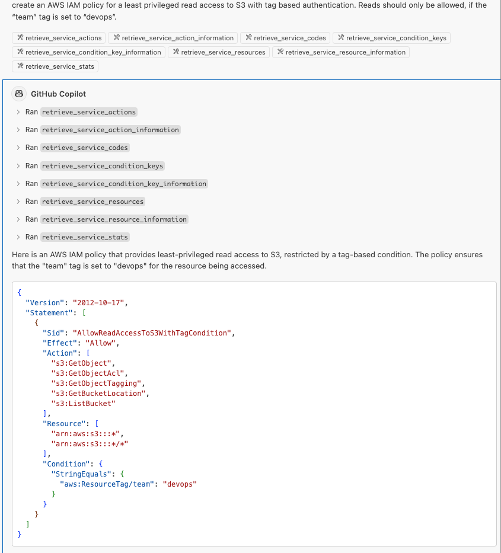

## What’s AWS IAM?
AWS Identity and Access Management (IAM) is a crucial service that helps you securely control access to AWS resources. IAM enables you to manage users, groups, and permissions, ensuring that only authorized individuals and applications can access specific resources. By defining policies, you can specify who can do what within your AWS environment, enhancing security and compliance.

## What’s the Service Authorization Reference?
Everything you need to create and maintain IAM policies is documented within the [Service Authorization Reference](https://docs.aws.amazon.com/service-authorization/latest/reference/reference_policies_actions-resources-contextkeys.html). A while ago, AWS eventually released these references as a collection of machine-readable JSON files that provide detailed metadata about the actions, resources, and condition keys available for each AWS service. This information is designed to help automate policy management workflows by allowing security administrators and developers to easily identify and incorporate the necessary permissions into their IAM policies.

By using this reference information, you can streamline the process of authoring and validating policies, ensuring that they are up-to-date with the latest AWS service capabilities. This not only simplifies the management of IAM policies but also enhances the security posture of your AWS environment by ensuring precise and accurate permissions.

[This blogpost](https://aws.amazon.com/blogs/security/use-aws-service-reference-information-to-automate-policy-management-workflows/) from AWS outlines clever uses of the service reference, I may follow up on these in a later post. But today I want to focus on using the service reference while coding in VSCode with GitHub Copilot. We can use MCP to feed the json data to GitHub Copilot.

## What’s MCP?
Model Context Protocol (MCP) is an open standard that connects AI assistants to various data sources, like content repositories and business tools, to enhance the relevance and quality of their responses. Think of it as a universal connector, similar to a USB-C port, but for AI applications.

## How to use it with GitHub CoPilot?
Luckily, [Paul Santus](https://medium.com/@paul.santus) invested some time and built a MCP-compatible server, which fetches the AWS service reference from the newly introduced json endpoints and enables queries to the data via MCP. All we need is a [docker container](https://github.com/psantus/aws-service-authorization-reference)! Love it, thanks Paul!

## Let’s set it up then!
Given you’ve already set up GitHub Copilot in your VSCode environment (otherwise see the documentation), open your settings.json and add the following code block:
```json
    "mcp": {
        "servers": {
            "aws-service-reference": {
                "command": "docker",
                "args": [
                    "run",
                    "-i",
                    "--rm",
                    "psantus86/aws-service-authorization-reference-mcp-server"
                ],
                "env": {}
            },
        },
    },
    "chat.mcp.discovery.enabled": false 
```    
_By the way: setting `chat.mcp.discovery.enabled` to true would allow VSCode to use other MCP integrations on your machine, e.g. when using the Claude Desktop App with activated MCP integrations_

(You may need to restart VSCode after adding this setting)

## Gimme some action!
Open GitHub Copilot Chat - depending on the chosen mode (Ask / Edit / Agent), the integration is either activated by default (agent mode) or can be enabled via “Add Context” button above the chat window. You need to add all eight actions manually (they all start with `retrieve_`.) 
In Agent Mode, there is a tooling icon above the chat window, allowing you to control MCP integrations via UI.

Start by choosing “Ask” and enable all retrieve-Actions via “Add Content”. Afterwards, ask copilot to create an AWS IAM policy for a least privileged read access to S3 with tag based authentication. Reads should only be allowed, if the “team” tag is set to “devops”. If using the integration for the first time, VSCode may ask for your approval before querying the integration.

Output _may_ look something _like_ this:



Obviously, that’s a very easy example. It’s just to get you started. Play around with it and try to challenge both the AI model(s) and the MCP integration. Paul did that as well btw - his [follow up blogpost is worth reading!](https://medium.com/@paul.santus/aws-service-reference-information-mcp-server-how-up-to-date-scoped-reference-data-helps-deliver-4592a52c8834)

`As always with AI: check the output for plausibility. While the MCP integration helps the model not to hallucinate IAM actions and policy constructs that are not existing, it’s still your responsibility to double check any IAM policy before deploying it!`